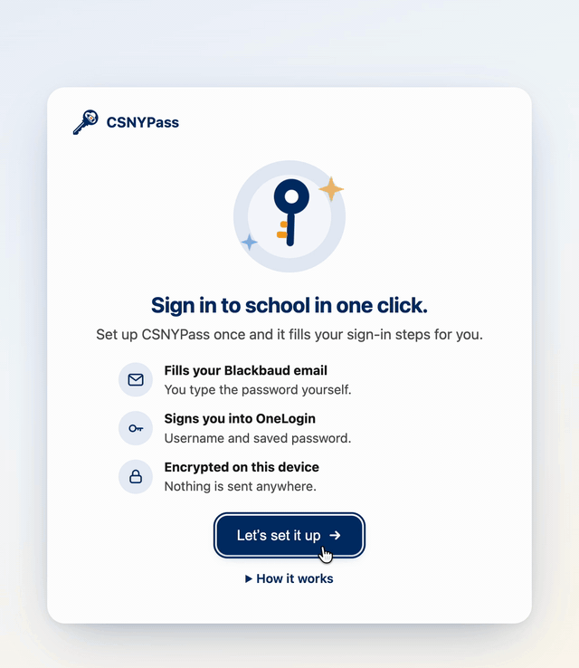
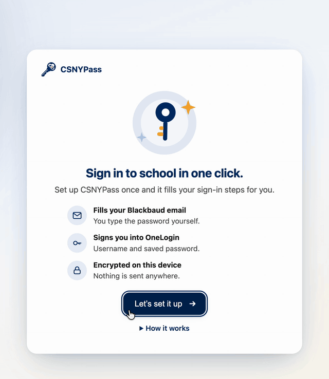
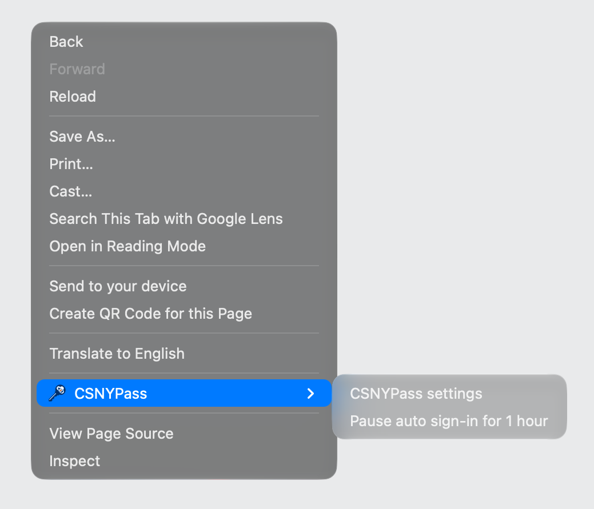
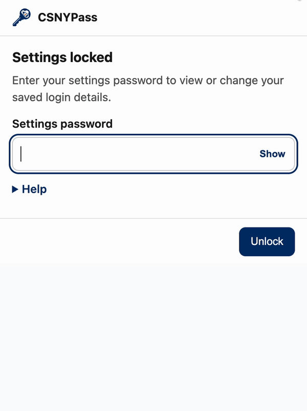
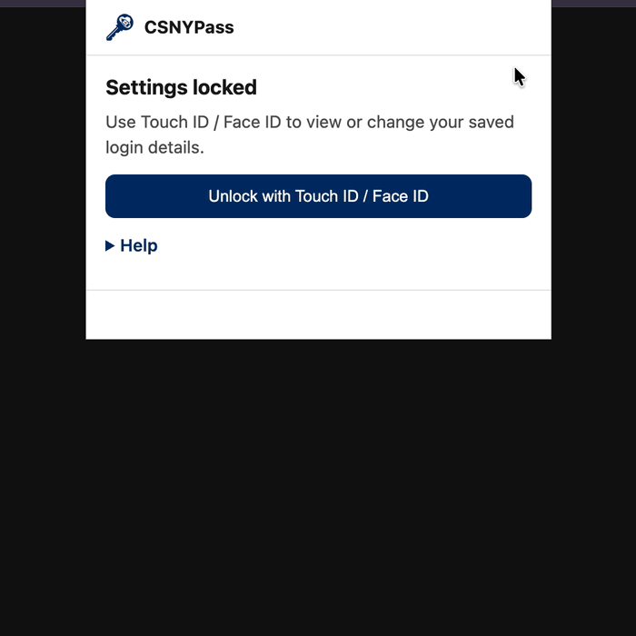

# CSNYPass

> Unofficial. CSNYPass is an independent project and is not affiliated with, endorsed by, or sponsored by Collegiate School, Blackbaud, or OneLogin. Those names belong to their owners and are used only to describe which sign-in pages the extension works on.

**CSNYPass is a free, open-source browser extension that fills in the Collegiate School sign-in pages for you.** It types your email on the Blackbaud student portal, picks "Collegiate School" on the Blackbaud sign-in hub, and fills your username and password on the school's OneLogin page, clicking Next / Continue for you if you want it to. You still type your Blackbaud password yourself.

Your saved login is encrypted and stays on your device. You choose how it's protected:

- **Full auto:** signs you in automatically, with no prompt. Opening settings needs a password.
- **Touch ID / Face ID:** your saved OneLogin password stays locked until you use Touch ID, Face ID or Windows Hello. The email steps run without a prompt, and you're asked only at the OneLogin password step and when you open settings. After you unlock, sign-in is automatic for as long as you chose.

It works in desktop **Chrome** and **Edge** (version 116 or newer). For iPhone, iPad and Android, use the [userscript version](https://github.com/techiebirb/CSNY-Auto-Sign-in-Userscript) instead.

## See it work

Both clips are real time, recorded on the real sign-in pages.

**Full auto**

https://github.com/user-attachments/assets/d5611d1f-1cb1-4fd5-a883-5a759bd64556

**Touch ID / Face ID**

https://github.com/user-attachments/assets/de64fffd-f33b-4fb6-8c32-468f07ae08b1

## Supported sites

| Site | What the extension does |
|------|-------------------------|
| [Blackbaud student portal](https://collegiateschool.myschoolapp.com/app/student) | Fills **Email address** and, if you want, clicks **Next**. You enter your Blackbaud password yourself. |
| [Blackbaud sign-in hub](https://app.blackbaud.com/signin/) (reached during single sign-on) | Clicks **Collegiate School** when **Automatically click Next / Continue** is on. |
| [CSNY OneLogin](https://csny.onelogin.com/login) | Fills your username (your email), optionally clicks **Continue**, then fills the OneLogin password from settings and clicks **Continue** again. |

## Install

**Chrome Web Store:** coming soon. Until then, you can install it manually in a minute or two.

### Manual install (developer mode)

1. Download this repository (**Code → Download ZIP**, then unzip it) or clone it. It already includes a pre-built `dist/` folder, so there's nothing to build. (Developers: see [CONTRIBUTING.md](CONTRIBUTING.md).)
2. Open `chrome://extensions` (Edge: `edge://extensions`), turn on **Developer mode**, click **Load unpacked**, and choose the folder that contains `manifest.json`.
3. A **welcome tab** opens on first install. If you close it, click the CSNYPass toolbar icon and choose **Set up CSNYPass**. Setup has three short steps:
   - **Login:** your school **email**, an optional **OneLogin password**, and whether CSNYPass should click Next / Continue for you.
   - **Protection:** pick **Full auto** (set a **settings password**, or choose **Use my OneLogin password to unlock settings**) or **Touch ID / Face ID** (pick how long one unlock lasts, then confirm when prompted).
   - **Done:** a summary, a few tips, and a shortcut to the sign-in page.
4. Open a supported sign-in page in the same browser and check that it fills in. You can turn automation off in settings at any time.

Here's what setup looks like. These clips are sped up, and the email and password are blurred:

<table>
  <tr>
    <th align="center">Full auto</th>
    <th align="center">Touch ID / Face ID</th>
  </tr>
  <tr>
    <td align="center"></td>
    <td align="center"></td>
  </tr>
</table>

## Using it

- **Blackbaud:** open the portal. CSNYPass fills your email and may click **Next**. Then type your Blackbaud password yourself.
- **OneLogin:** this usually comes after Blackbaud. CSNYPass fills your username and password steps if you saved them. If OneLogin has the wrong account filled in, click **Not you?** yourself. CSNYPass never clicks it.

### Toolbar badge, pausing, and safety limits

- **Badge:** the toolbar icon shows **OFF** when automation is turned off or paused.
- **Pause:** right-click a sign-in page and choose **Pause auto sign-in for 1 hour** (or **Resume auto sign-in**). Pausing needs no unlock, and it ends by itself after an hour or when you close the browser.
- **Retry limit:** if OneLogin rejects the saved password, CSNYPass tries at most twice in 5 minutes per tab and then stops, so your account isn't locked out. Fix the saved password in settings and reload the page.
- **Different account:** if the OneLogin username box already holds another email, CSNYPass leaves it alone.

## Settings

Click the **CSNYPass** toolbar icon to open settings in a small popup. If you prefer a bigger window, right-click the icon and choose **Options** to open the same page in a full tab.

After the first save, settings open on a **locked** screen. Unlock it with your settings password (Full auto) or Touch ID / Face ID. Once unlocked, an **Automation on/off** chip at the top shows whether CSNYPass is active. The unlocked screen locks itself again after 30 minutes.

<table>
  <tr>
    <th align="center">Full auto: password</th>
    <th align="center">Touch ID / Face ID</th>
  </tr>
  <tr>
    <td align="center"></td>
    <td align="center"></td>
  </tr>
</table>

| Setting | What it does |
|--------|---------|
| Sign-in & settings protection | Choose **Full auto** or **Touch ID / Face ID** (see below). You can switch later. |
| Settings password | Full auto only. Needed to open the settings screen. |
| Use OneLogin password to unlock settings | Full auto only. Your saved OneLogin password also unlocks settings, so it can't be left blank while this is on. |
| How long one unlock lasts | Touch ID / Face ID only. **Every sign-in** (asks each time; the unlock ends after the login is submitted, or after 3 minutes), **Until I close the browser**, or **A set number of minutes**. |
| Enable automation | Turns CSNYPass on or off. |
| Email | Your login email (used for Blackbaud and OneLogin). |
| Password (OneLogin) | Optional if you only use the Blackbaud email step. |
| Automatically click Next / Continue | Clicks the button for you after filling in a field. |
| Advanced → wait before clicking | How long to wait before clicking (default 300 ms; 0 means no wait). Raise it if buttons stay disabled for a moment (try 500–1000 ms). |

### Touch ID / Face ID mode

Your email isn't treated as a secret, so the Blackbaud email step, the "Collegiate School" button and the OneLogin username step run with no prompt. When the OneLogin **password** box appears and the password is still locked, a small **Unlock to sign in** window opens. Use Touch ID / Face ID and the sign-in carries on by itself. If you dismiss the window, it won't reappear for a minute; reload the sign-in page to bring it back. Opening settings always needs a fresh Touch ID / Face ID. You can [watch this mode sign in](#see-it-work) above.

CSNYPass only acts on real sign-in screens (the Blackbaud email form, the Blackbaud "Collegiate School" button, and the OneLogin username and password form). It never prompts while you browse the signed-in site, for example a class bulletin board.

This mode uses WebAuthn with the PRF extension. That needs Chrome or Edge 116 or newer and a device with a built-in authenticator (Touch ID, Face ID or Windows Hello). If your browser or device can't do it, the option is hidden or setup tells you so, and nothing is changed.

## Privacy and encryption

In short:

- Your settings are saved only in **extension storage on your device**. They are never sent to GitHub, the author, or anyone else.
- Your email and password are encrypted with **AES-256-GCM** (with the format version authenticated) before they're written to `storage.local`.
- CSNYPass makes no network requests of its own and has no analytics.

Here's how each mode protects your data, including what it doesn't protect against.

**Full auto**
- A random data key is generated on first use and kept as a **non-extractable** key in the extension's IndexedDB, separate from the encrypted data. Its bytes can't be read back out through any API.
- The settings **password** (PBKDF2-SHA-256, 600,000 iterations, or your OneLogin password) only controls access to the settings screen. Repeated wrong attempts add an increasing delay.
- **What this protects:** someone casually reading or copying the stored data, and casual use of the settings screen on a computer you left unlocked.
- **What this does not protect:** a full copy of your browser profile, malware, or anyone with full access to your signed-in user account. The extension has to be able to reach the key for sign-in to be fully automatic, so anyone who can run code as you can use it too.

**Touch ID / Face ID**
- The data key is never stored in the clear. Only a copy **wrapped by a key derived from your biometric** (WebAuthn PRF) is saved. Without a successful Touch ID / Face ID, the stored data can't be decrypted.
- After you unlock, the data key is held in memory-only extension storage. It's cleared when the browser closes, or sooner if you chose a shorter unlock.
- Your email and settings toggles (never the password) are also kept in a separate copy encrypted with a non-extractable key, so the email steps work without Touch ID / Face ID. The password is released only to the OneLogin sign-in page.
- **What this does not protect:** malware running as you *while* CSNYPass is unlocked.

**Forgot your password, or lost access to your biometric?** There is no recovery, because the data can't be decrypted without it. Use **Clear all saved data and start over** in the Help section of the settings page, then set up again. You don't need to remove the extension.

See [PRIVACY.md](PRIVACY.md) for the full privacy policy.

## Troubleshooting

- **Nothing happens:** make sure the extension is enabled. Unlock settings, check that your email is saved and **Enable automation** is on, then reload the sign-in page.
- **Forgot your settings password, or Touch ID stopped working:** see **Privacy and encryption** above. Clear all saved data and set up again.
- **"Saved settings could not be read":** use **Clear all saved data and start over** on the settings page, then set up again. Sign-in automation won't run until settings are saved again.
- **Nothing happens at the OneLogin password step in Touch ID / Face ID mode:** the password is still locked and the unlock window was dismissed or hidden. Wait a minute, reload the sign-in page, and use Touch ID / Face ID in the window that opens.
- **Next / Continue stays gray:** open **Advanced** in settings, raise the wait before clicking (try 500–1000 ms), save, and reload.
- **Still not sure what's happening?** On the sign-in page, open the browser console and look for messages starting with `[CSNYPass]`.

<strong>"Access other apps and services on this device" (Chrome)</strong>

This is **not** an extra extension permission. Chrome is asking whether **`collegiateschool.myschoolapp.com`** (or another sign-in site during single sign-on) may use **Apps on device** (Local Network Access), often to reach a desktop SSO or MFA helper on your machine. You may see it **once per site**, even with the extension turned off, when you click **Next** yourself.

**Allow** it once for a smoother sign-in, or use the lock icon next to the address bar → **Apps on device** → **Allow**. You can also allow sites at `chrome://settings/content/loopbackNetwork` (Edge: **Settings → Privacy → Site permissions → Apps on device**), for example `https://collegiateschool.myschoolapp.com`, and during single sign-on `https://app.blackbaud.com` and `https://csny.onelogin.com`.

If you dismiss the prompt, the site may ask again. Turning off **Automatically click Next / Continue** reduces repeated **Next** / SSO clicks while the dialog is open. CSNYPass also throttles repeat auto-clicks so it doesn't hammer the same step every few hundred milliseconds.

Still stuck? [Open an issue](https://github.com/techiebirb/CSNYPass/issues).

## Contributing

Bug reports and pull requests are welcome. See [CONTRIBUTING.md](CONTRIBUTING.md) for how to build, test and release, and [AGENTS.md](AGENTS.md) for instructions for AI coding agents. Please never commit real credentials.

## License

[MIT](LICENSE)
